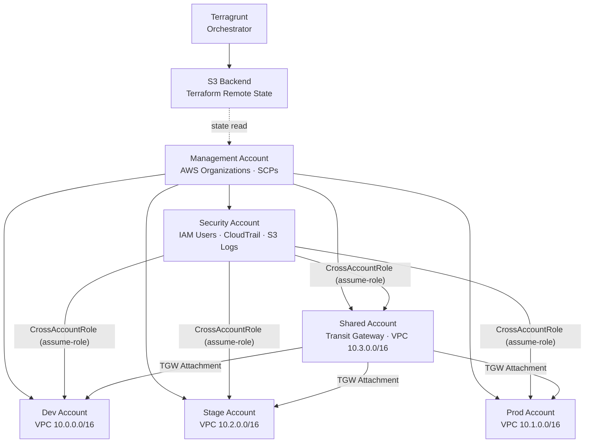

# AWS Multi-Account Foundation

Terraform and Terragrunt patterns for building an AWS Organizations-based multi-account foundation. Covers account separation, shared networking with Transit Gateway, security-account IAM management, cross-account roles, remote state, and reusable VPC/subnet building blocks.

## Architecture



## Repository Structure

```
infra-organization/
├── master/
│   ├── organization/          # AWS Organizations + account creation
│   └── temp-admin/            # Bootstrap admin role
├── infrastructure-live/
│   ├── security/              # IAM users, CloudTrail, S3 logs
│   ├── shared/                # Transit Gateway, VPCs per environment
│   ├── dev/                   # Dev account baseline
│   ├── stage/                 # Stage account baseline
│   └── prod/                  # Prod account baseline
└── infrastructure-modules/
    ├── aws-vpc/               # VPC + IGW
    ├── aws-subnet/            # Public/private subnets + NAT
    ├── transit_gateway/       # TGW + RAM sharing
    ├── transit_gateway_route/ # TGW static routes
    ├── subnet_route/          # Subnet route table entries
    ├── cross-account-role/    # IAM cross-account assume-role
    ├── iam-user-group/        # IAM user group management
    └── assume-role-policy/    # Assume-role policy documents
```

## Prerequisites

- [Terraform](https://learn.hashicorp.com/tutorials/terraform/install-cli) installed
- [Terragrunt](https://terragrunt.gruntwork.io/docs/getting-started/install/) installed
- [AWS CLI](https://docs.aws.amazon.com/cli/latest/userguide/getting-started-install.html) configured
- S3 bucket for Terraform remote state (e.g. `example-app-tfstate`)
- IAM user with admin permissions
- GPG key for secret management (e.g. [GPG Keychain](https://gpgtools.org/))

## Usage

1. Configure AWS CLI credentials:
```shell
aws configure
```

2. Bootstrap the organization from the master account:
```shell
cd infra-organization/master
./init.sh -a <access_key> -s <secret_key> -k <keybase_profile>
```

3. Apply per-account infrastructure with Terragrunt:
```shell
cd infra-organization
terragrunt run-all apply
```
